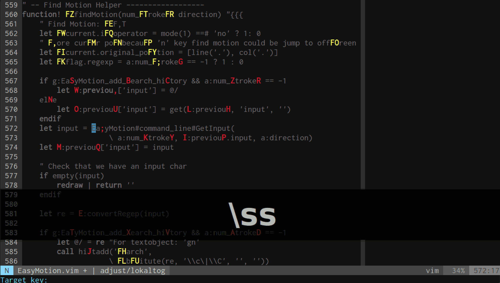
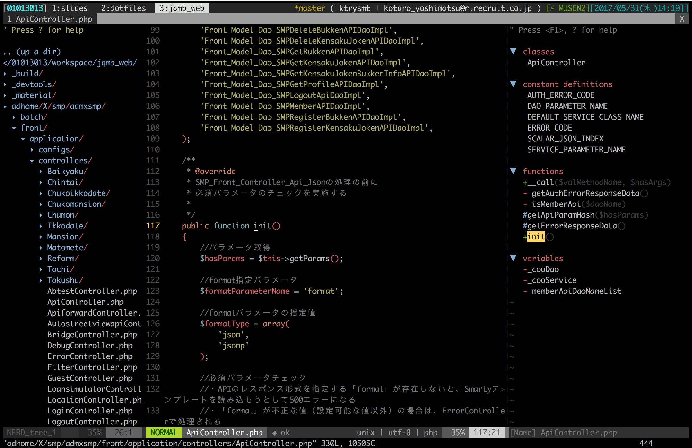
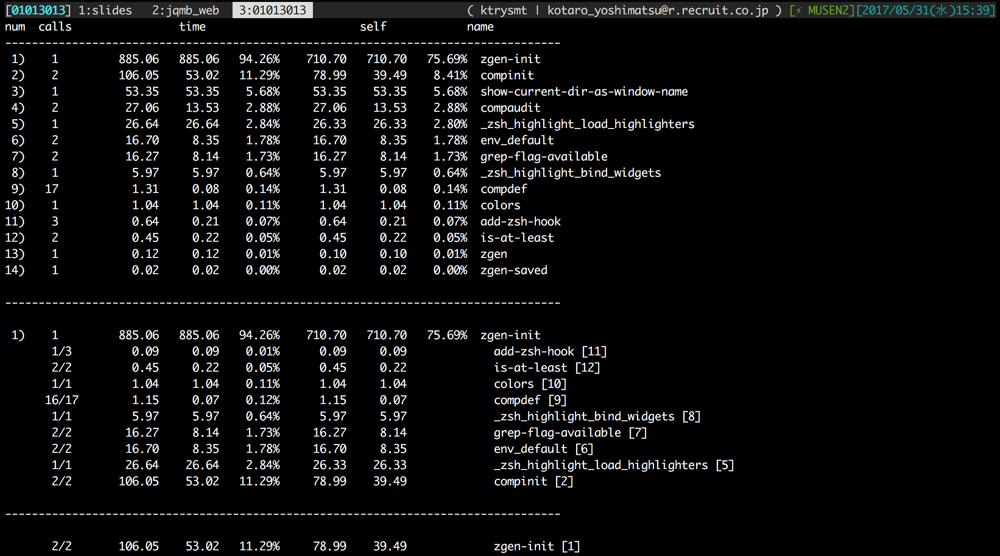

## Whoami


Kotaro Yoshimatsu

@ktrysmt

<https://twitter.com/ktrysmt>  
<https://github.com/ktrysmt>

経歴
* 学生時代 PerlMonger
* 受託開発会社 5年くらい
* リクルート住まいカンパニー 2年目 ← ｲﾏｺｺ

---

みなさん

---

コードレビューしてますか。

---

ある日のプルリクレビュー。

---

プルリクの本数
* だいたい6~8本

技術スタック
* JS
* PHP
* nodejs
* docker
* インフラ系いろいろ

アサインされてないやつも時々巡回してたり

---

問題点
1. 技術スタックが多岐にわたる
2. そもそも数が多い

---

対策しましょう。

---

1. 豊富な技術スタック
2. 数が多い

---

### 1. 豊富な技術スタック

---

技術スタックが多岐にわたるのは  
どうすればいいか。

---

エコシステムが巨大で対応技術の多い，  
安定した開発環境が必要。

---

→ Vimでしょ。

---

（すみませんただの好みです）

一応弁明すると，

Vimもプラグインが豊富にあり，CLIベースなのでIntegrationも柔軟。

大抵の言語は標準でサポート，それ以外もエコシステムがだいたい吸収してくれる。

---

Vimについては語りだすとキリがないので…

コードレビューに役立ちそうなTips，  
プラグインを一部紹介。

---

* vim-fugitive
* ale
* vim-easymotion
* tagbar & filer
* auto-ctags
* 高速vimgrep（※後述）

---

**vim-fugitive**


Vim上でGit操作いろいろできるやつ。

`:Gdiff` で表示して

`[c`,`]c` でhunk単位で移動

---

**ale**

最近の言語とそのエコシステムに一通り対応してる lint & static check の基盤。
主要言語の静的解析にだいたい対応してる。

非同期対応なので作業の邪魔をせず，快適。

特別な設定なしにプラグインを入れるだけでいいのがGood。

---

**vim-easymotion**

コード上を縦横無尽に動き回れるようになる




---

**tagbar & filer**

移動や探査がラクになる。



---

**auto-ctags**

ctagsのタグファイル自動生成。

* `:Ctags` でOK
* `let g:auto_ctags = 1` で保存時自動生成

---

ctagsとは  

> 変数・関数・DOCコメント等の定義リスト（タグファイル）をソースコードから生成するツールで，IDEでよくある宣言ジャンプや呼び出し元への復帰を助ける仕組み。

auto-ctagsはこのタグファイル生成をVimから操作しやすくしてくれます。

---

**ctagsについて**

---

ctagsはメンテされていないらしいので...

---

universal-ctags を使いましょう

---

**universal-ctags**

* ビルドインストールを推奨
* ちゃんとメンテされてる（モダン言語にも対応してる）

前述のauto-ctagsで，Vimが更に便利に。

---

**豊富な技術スタック対策のまとめ**

* 巨大なエコシステムに乗っかりましょう
  * Vim以外にも色々 IntelliJ,Emacs,Atom,VSCode...
* 最近だとVSCODEもいいですね
  * 開発が活発
  * IDEらしさもちゃんとあり
  * プラグインが豊富
  * 意外と軽い
  * 無料

サーバーサイドやインフラを生業とする人は，VimやEmacs使いが多そう。

---

次。

---

### 2. 数が多い

---

気合で。

---

### 2. 数が多い → 気合

気合というのは（半分）冗談で…。

---

高速化・効率化できる工夫をしていきましょう。

---

効率化できる余地を探す

---

私の環境の場合

zsh, vim, tig, etc...

なので...

---

この辺の手入れをしてみる

* git & tig
* zsh
* vim
* そのほか

それぞれ効率化できそうな場所を探していきます

---

**git**

---

**レビューでよくつかうalias**

alias gdw="git diff --color-words"

alias glogg='git log --graph --name-status --pretty=format:"%C(red)%h %C(green)%an %Creset%s %C(yellow)%d%Creset"'

alias gbrc="~/dotfiles/bin/git-checkout-remote-branch"

---

**alias gdw="git diff --color-words"**

インラインdiff

spaceやインデントをスルーしてくれるので変数名・関数名の変更などが見やすくなる

通常の`git diff`と適宜使い分け。

---

**alias glogg='git log --graph --name-status --pretty=format:"%C(red)%h %C(green)%an %Creset%s %C(yellow)%d%Creset"'**

tigがめんどくさいときに。`--pretty`は表現力が高いので自分の使いやすいように加工すると良い。

---

**alias gbrc="~/dotfiles/bin/git-checkout-remote-branch"**

gbr(git branch --remote)の出力をfuzzy finderで絞込選択し，選択後自動的に当該ブランチをチェックアウトします。

マジ便利。

特に，ブランチ名が長い・リモートブランチ数が多いリポジトリにおすすめ。

* <https://github.com/b4b4r07/git-br>

---

**tig**

---

**私の.tigrc**

```
bind generic g move-first-line
bind generic G move-last-line
bind main G move-last-line
bind main R !git rebase -i %(commit)
bind diff R !git rebase -i %(commit)
set main-view = id:width=6 date author commit-title:graph=yes,refs=yes
set diff-context = 6
set split-view-width = 70%
set line-graphics = utf-8
```

---

* split表示時の幅をもう少し広く
* g,G を使ってより移動をVimっぽく
* 任意のログ行で Shift + R すると git rebase -i 起動
* 行頭にコミットハッシュ値を６文字表示
* diff閲覧時の差分の前後を３行→６行に増やす

---

**zsh**

---

**いろいろあります**

* 高速プラグインマネージャ
* 各種プラグイン
* fizzy finder との組み合わせ
* zshのパフォーマンス計測

---

**高速プラグインマネージャ**

antigen, zgen, zplug など

zsh使うならぜひ使いましょう

これがないと生きていけない...

---

**各種プラグイン**

* oh-my-zsh/plugins/*
* zsh-users/*

だいたいこの辺入れとけばいい感じになります

（特に補完系）

それぞれかなり量が多いので，使えそうだなと思ったものから一つずつ試してみると良いです

（特に補完系）

---

**fizzy finder との組み合わせ**

* ghq + peco
* powered_cd + fzf

---

**ghq + peco**

history | peco と似たような感じ

リポジトリで管理されているものは全部 `ghq get` で取得するようにすると，幸せになれます

`alias gh='cd $(ghq list -p | peco)'`

* ghq管理下のリポジトリ一覧から
* pecoで選んで
* cd

---

**powerd_cd + fzf**

薄いshellscript

enhancdと似てますが，enhancdはちょっと高機能すぎるというときに

リポジトリ管理外の書き捨てのコードや一時的に落としただけのソースがある場所も含め，全体的にcdの履歴管理をしてくれます

`alias c="powered_cd"` は必須です

マジ便利

<http://qiita.com/arks22/items/8515a7f4eab37cfbfb17>

---

**zshのパフォーマンス計測**

---

効率的なzshのプラクティスは多いが，それでも起動が遅いときはたまにある

特に私はtmuxを多用するので，zshの起動時間はできるだけ速いほうが嬉しい...

計測をし，遅い箇所を特定できるようになりたい

---

**単純な例**

---

```
$ time (zsh -i -c exit)
```

で，Initializeにかかる時間を計測

（↑起動してすぐexitしてる）

---

**遅い箇所をもうちょっと特定できないか**

---

できます

---

こういうのを仕込むと

```sh
# .zshenv
zmodload zsh/zprof && zprof
```

```sh
# .zshrc の末行に
if (which zprof > /dev/null) ;then
** zprof | less
fi
```

---

起動時に計測結果が表示される



使わないときは `.zshenv` のほうをコメントアウト

---

話はわかったが

---

めんどくさい！

---

**...というあなたに**

fish & fisherman おすすめ

---

<http://fishshell.com>

* ほぼ設定不要
* 軽い
* デフォルトの状態でかなり便利
  * 補完
  * 履歴管理，などなど
* プラグインマネージャーも安定（fisherman）

---

**高速grep**

---

高速grepといえば

ag, pt, ack いろいろありますが...

---

**ripgrep**

---

インストールしておくといいです

並列処理で，めちゃくちゃ速い

* <https://github.com/BurntSushi/ripgrep>

---

**Vimmer向け**

外部vimgrepにripgrepを設定するとマジで幸せになれます！

```
if executable("rg")
  set grepprg=rg\ --vimgrep\ --no-heading
  set grepformat=%f:%l:%c:%m,%f:%l:%m
endif
```

```
command! -nargs=* -complete=file Rg :tabnew | :silent grep <args>
```

```
command! -nargs=* -complete=file Rgg :tabnew | :silent grep --sort-files <args>
```

※ここ最近で一番いいコードだと思ってる

---

注意点

デフォルトではsortはされないので，

* `--sort-files` をつけるか，
* `| sort` 

するとよいです

`--sort-files` はシングルスレッドになるので，  
パフォーマンスに注意。

---

**まとめ**

本当にその作業は必要ですかというハックも，  
もちろん大事ですが…

一技術者として，

手に馴染んだ道具を手入れしたり，工夫したり，ケアをすることも大切なことだと思います。

---

普段から手入れをしておくと，

本当に困ったとき＝緊急時，救われます。

---

引き続き，作業効率が改善する仕組みやツールを探し中です。

みなさんも「これ便利だよ」というものがありましたら教えてください。

泣いて喜びます :joy:

---

__EOD__
